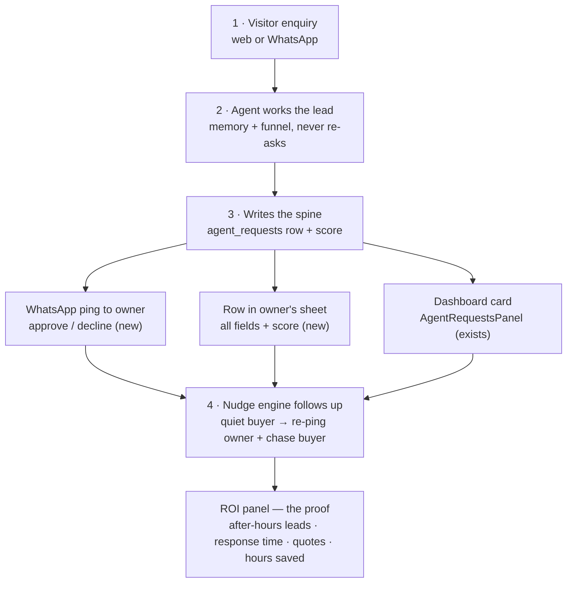

# Agentic Operations OS for Chemical SMBs — Owner Value Blueprint

> **Status: SCOPED TO v1 (2026-06-29, after a strict review).** The original
> blueprint was an over-scoped multi-year platform. This version keeps the
> sales-driving core as **v1** and demotes everything else to an explicit
> *earn-it-later backlog*. Sibling doc:
> [intelligent-agent-memory-plan.md](intelligent-agent-memory-plan.md).

> **Product identity (north star, unchanged):** an **AI Agent (the worker) + BI
> (the brain) + ERP-lite (the system of record)** on one company-scoped spine.
> The wedge: *one agent that runs the operation and keeps its own books.* That is
> the long-term vision. **v1 only ships the agent (the worker) + the proof it
> works.** We earn the BI and ERP layers by first proving the sales lift.

## Review outcome (why this doc was cut down)

The full 12-phase vision had three fatal build risks: (1) **scope** — ERP-lite,
RBAC, competitive price research, a learning loop, and five channels is a
multi-year roadmap, not a feature; (2) **n=1 design** — it was shaped around one
relative's factory; (3) **COGS vs SMB pricing** — unbounded background jobs can
make the LLM cost exceed what a SMB will pay.

The sales value lives in ~4 phases. Speed-to-lead, after-hours capture, and
follow-up are ~80% of the revenue value in ~20% of the plan. **Build those, prove
the ROI on the design-partner company, land customers #2 and #3, then earn the
rest.**

---

## 1. The owner's day: before vs after (v1)

**Before.** A visitor asks a question; the bot answers from RAG or says "I don't
have that." Leads land in a list the owner must remember to open. The owner
manually reads enquiries, copies them into a spreadsheet, prices quotes over
WhatsApp, and chases people who went quiet.

**After (v1).** The agent qualifies the visitor like a salesperson, captures and
scores the lead, then **pushes the result everywhere the owner already works**
(WhatsApp ping + the owner's Sheet + the dashboard) and **chases the follow-up**
so nothing drops. The owner stops doing data entry and chasing; they step in only
to approve/price the high-value moment.

---

## 2. v1 scope — the only four things we build now

Each is one durable spine write + a fan-out + (optionally) a follow-up. "(exists)"
reuses current code; "(new)" is net-new.

### Phase 1 — Memory + funnel core (the foundation)
The agent remembers the whole conversation, carries resolved product/grade/quote
across turns, and never re-asks. From [intelligent-agent-memory-plan.md](intelligent-agent-memory-plan.md)
(Phases 0–1). Without this the bot feels un-intelligent; everything else rides on
it. Reuses `agent.py` tools and the `compliance_gate` node (SDS from tools only).

### Phase 2 — WhatsApp owner-notify
On lead/sample/quote commit, fire a WhatsApp ping to the owner ("🧪 Ethanol
99.9%, 500 ml, Acme Labs — warm. Reply 1 approve, 2 decline."). New transport
module mirroring `email_provider.py`'s never-raise, provider-fallback shape;
fan-out alongside `agent_handoff.py` (exists). **Owner-notify only — not
buyer-facing yet** (consent/template-approval is later).

### Phase 3 — Outbound Sheets sync
Append-on-commit from the `agent_requests` write path into the owner's own Google
Sheet, with all fields + lead score. Per-tenant Sheet ID in company settings.
Kills manual data entry. Tenant-isolated (a company writes only to its own Sheet).

### Phase 4 — Nudge / follow-up engine
A new cron job on `run_cron.py`: if the owner hasn't acted in 24h, re-ping; if a
buyer goes quiet after a quote, nudge the buyer and remind the owner. Cadence
owner-configurable. Reuses the weekly-digest dedupe pattern.

### Cross-cutting — ROI "value delivered" panel
From day one, instrument and surface: after-hours leads handled, speed-to-lead
delta, quotes generated, hours saved. This is the renewal argument and the pitch
to the next customer. **Not optional — it is how we prove v1 worked.**

### The v1 flow (one picture)

---

## 3. Cost & model strategy (the part the original plan ignored)

If we provide the LLM, COGS is real and must be bounded.

**Model split — already in the stack (`core/config.py` `MODEL_MAPPING`), no new
providers:**
- **`gemini-2.5-flash` / `gemini-2.5-pro`** — the agent loop / reasoning, tier-
  dependent (flash-lite for FREE/EXPLORE, flash for STARTER, pro for PRO/BYOD).
  Already wired in `main.py` — no change needed.
- **`gemini-2.5-flash-lite`** — all cheap background tasks: session summaries,
  classification, digests, OCR. Already used at `main.py:2093`, `5517`, `10262`.
- No Claude, no OpenAI, no self-hosting. Gemini only, as already deployed.
- Prompt caching on the persona + catalog prefix reduces repeat input cost.

**The silent cost-killer is background jobs**, not the chat. That is the main
reason competitive price research and the learning loop are cut from v1 — both
are unbounded token sinks. **Meter per tenant** (reuse `byod_usage_ledger` /
`usage_tracking`), **cap any background job**, and **tier pricing by conversation
volume** — at high volume a single tenant's COGS can exceed a flat SMB
subscription.

**No fine-tuning, no self-hosted open model.** LLMs do not learn from usage;
there is no "auto fine-tune as they use it." The product gets sharper per tenant
via **memory + RAG + the structured spine** (in-context/retrieval learning), not
weight updates. Per-tenant fine-tuning would need data a SMB can't produce, host a
model copy per tenant, risk catastrophic forgetting, and — worst — weaken the
SDS/hazard safety gate, which is the moat.

---

## 4. v1 ecosystem (deliberately minimal)

| Surface | Status | Role in v1 |
|---|---|---|
| Email (Resend + SMTP) | exists (`email_provider.py`) | alerts, buyer follow-ups |
| Dashboard pipeline | exists (`AgentRequestsPanel`) | approve/decline, ROI panel |
| Lead scoring + hot alerts | exists (`lead_scoring.py`) | prioritization |
| Inbound spreadsheet import | exists (`catalog_import.py`) | one-upload setup |
| Cron scaffold | exists (`run_cron.py`) | the nudge engine |
| **WhatsApp Business (owner-notify)** | **new (FIRST)** | owner's primary notify surface |
| **Outbound Sheets sync** | **new** | owner's Excel auto-filled live |
| **Nudge / follow-up engine** | **new (rides cron)** | follow-ups for owner + buyer |

Design rule (unchanged): every integration is **config-driven per tenant** (pack
registry + company settings), never `if vertical ==`.

---

## 5. What we cut, and why (do NOT build these in v1)

| Cut feature | Reason |
|---|---|
| **ERP-lite: orders / tasks lifecycle** | A separate product; competes with the Tally/Zoho/SAP the owner already runs. Integrate later, never replace. |
| **Competitive price web-research** | Legal/ethical grey (scraping competitor prices), unreliable CAS/grade matching, false-confidence wrong price, unbounded token cost. |
| **Owner cockpit + daily BI briefing** | Stickiness, not sales. Earn it after the sales lift is proven. |
| **Daily learning loop** | This is the "learning" — and it's memory/RAG, not fine-tuning. Defer the nightly batch (token cost) until v1 is live. |
| **Email/message drafting + reply-back** | Nice, not load-bearing for the sales motion. |
| **Buyer-facing WhatsApp / Instagram / Slack** | WhatsApp owner-notify first; buyer-facing needs consent + template approval. Multi-channel dilutes. |
| **RBAC / team roles** | Owner-only is fine for v1. Only keep the schema future-proof (role column, `tasks.assignee` → user_id) — build no role UI. |
| **Per-tenant fine-tuning / self-hosted model** | Misconception (see §3). Memory + RAG is the mechanism. |

---

## 6. Earn-it-later backlog (the north star, after v1 proves out)

Build these *only after* v1 ships, the ROI panel shows real lift, and there are
≥3 paying chemical customers (so the pack is validated beyond n=1):

1. BI suggestion engine + demand/lost-sale analytics + daily briefing.
2. Owner WhatsApp reply-back loop (approve/price from WhatsApp → relay to buyer).
3. Email/message drafting with an owner approval queue.
4. Owner cockpit ("settled on login" home view).
5. Daily learning loop (nightly outcome ingest → memory + BI).
6. ERP-lite spine: orders + tasks lifecycle — **only if** customers ask and we
   integrate with their existing accounting rather than replace it.
7. Buyer-facing WhatsApp, then Instagram / unified inbox.
8. RBAC: Sales / Operations / Viewer roles.
9. (Parked, maybe never) competitive price research.

The one-spine architecture (`lead_capture → agent_requests → orders → tasks`,
agent writes / BI reads / cockpit renders) stays the design target — we just
don't pour the foundation until the walls are paying for themselves.

---

## 7. Verification (per v1 slice, end to end)

- **Memory/funnel:** scripted multi-turn chat (Ethanol sample → returning
  visitor) against `/api/chat`; assert the agent never re-asks and the funnel
  state advances. A transcript eval gate for the compliance node — a safety
  answer that isn't tool-grounded must fail the build.
- **WhatsApp:** sandbox/number test — fire a sample request, assert the owner
  message renders and the never-raise contract holds when the API is down (mirror
  `test_agent_handoff.py` / `test_slack_handoff.py`).
- **Sheets sync:** create a request, assert a row appends to a test Sheet with all
  fields + score; tenant isolation (a company writes only to its own Sheet).
- **Nudge engine:** run the cron job against seeded stale leads; assert re-ping
  fires once (dedupe like the weekly digest) and respects owner cadence.
- **ROI panel:** assert recovered-revenue / hours-saved math from seeded pipeline.
- **Cost guardrail:** assert per-tenant metering records usage and that no
  background job runs unbounded.

---

## 8. Open questions to resolve before implementation
- WhatsApp provider: Meta Cloud API direct vs Twilio (cost, approval time,
  per-conversation pricing) — affects Phase 2 message design.
- Sheets vs Excel: Google Sheets API (live append) vs periodic .xlsx export —
  owner said "personal Excel"; confirm which they actually use.
- Nudge aggressiveness default (sales-forward vs not pushy) — owner-configurable.
- Per-tenant pricing tiers vs metered COGS — lock a model before onboarding paid.

## Related
- [[intelligent-agent-memory]] — the memory/funnel engine v1 rides on.
- [[chemical-vertical-agent]] — the pack, tools, and SDS guardrail foundation.
- [[catalog-auto-import]] — populates the catalog the agent reasons over.
