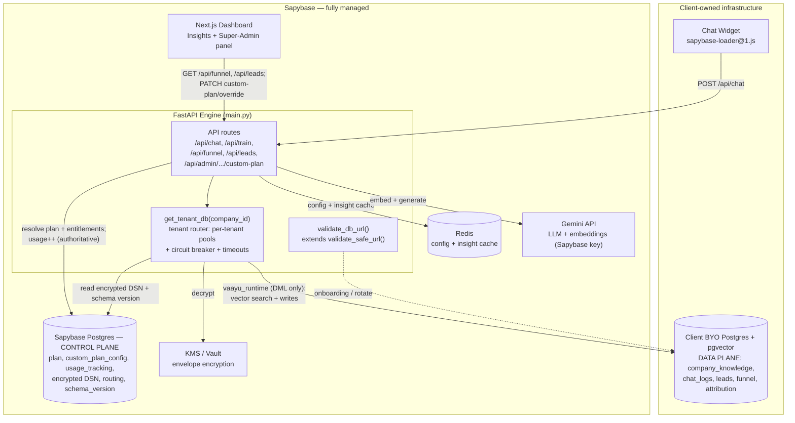
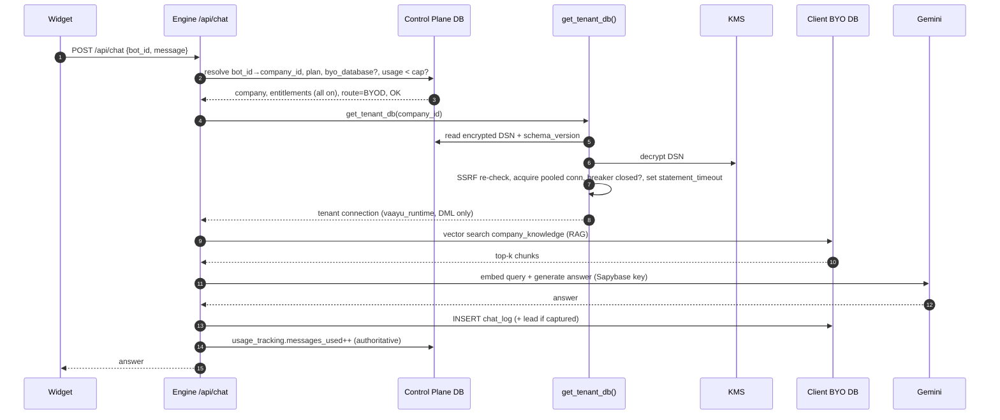
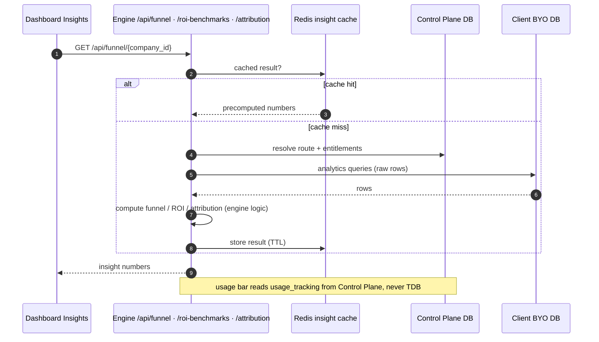
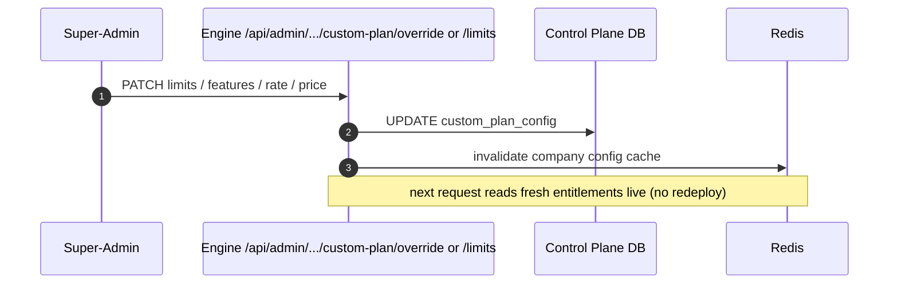

# RFC: Build-Your-Own-Database (BYOD) for Vaayu Intelligence

**Status:** Design / Proposed (no code written)
**Author:** Sapybase Engineering
**Last updated:** 2026-06-14
**Scope:** A new top-tier plan where the client supplies **only** their PostgreSQL database. Everything else — the engine, the LLM/embeddings, the dashboard, the widget, all features — runs on Sapybase. This document is the authoritative, foolproof plan: security, anti-tamper, schema synchronization, and multi-tenant performance. It ends with **hard implementation rules** any engineer or AI agent MUST follow.

---

## 1. Goals & Non-Goals

### Goals
- One new plan, **BYOD**, with **every feature enabled** (all `PLAN_LIMITS` flags `True`).
- The client provides a **single Postgres connection string**; nothing else.
- The **Sapybase engine remains 100% managed by Sapybase** (control plane + AI inference). The client's database is a pure **data plane** (storage only — it runs none of our logic).
- **No path for a client to cheat** billing, entitlements, or usage by editing their own database.
- **Perfect schema synchronization** between each client DB and the engine, with zero broken states during feature rollouts.
- **No noisy-neighbor degradation**: one client's slow/large/broken database MUST NOT slow Vaayu Intelligence for any other client.

### Non-Goals (explicitly out of scope for v1)
- Bring-your-own-LLM-key (LLM stays on Sapybase's key → see §3 cost control).
- Self-hosting the engine on the client's server (this is BYO-**Database**, not BYO-Server).
- Cross-database data replication or multi-region failover of the client's DB (that is the client's responsibility).
- Self-serve BYOD for Starter/Growth/Scale (BYOD is Enterprise/Custom-gated only).

---

## 2. Architecture: the Two-Plane Model

Everything in this RFC follows from one rule:

> **The control plane is the source of truth. The client's database is untrusted storage.**

| | **Control Plane** (Sapybase infra — always) | **Data Plane** (client's Postgres — BYOD only) |
|---|---|---|
| **Holds** | plan/tier, `subscription_status`, Polar IDs, entitlements, **usage counters**, encrypted DB credentials, bot→DB routing, schema-version registry, audit log, insight cache | `company_knowledge` (vectors), `chat_logs`, `leads`, funnel events, `lead_attribution` — raw operational rows only |
| **Trust** | Trusted, authoritative | **Untrusted** — never drives billing/entitlement |
| **Runs logic?** | Yes — all of it (engine, AI, scoring, analytics math) | **No** — storage only |
| **Owned by** | Sapybase | Client |

**Consequence:** the only thing that physically changes per BYOD client is *which database the engine opens a connection to* for that client's data rows. All intelligence (RAG, prompts, lead scoring, funnel, ROI, attribution) executes inside the Sapybase engine, reading raw rows from the client DB and never exposing Sapybase IP to the client's infrastructure.

> **Diagrams:** see **Appendix A** for the full component architecture, the user data-flow (chat) sequence, onboarding/provisioning, insights, super-admin config propagation, and the migration-rollout diagrams — all mapped to real endpoints and code hook points.

---

## 3. Plan & Entitlement Model (configured)

BYOD is implemented as a **specialization of the existing Custom-Plan machinery** (`CUSTOM_PLAN_DEFAULTS`, `CUSTOM_PLAN_FEATURE_KEYS`, `custom_plan_config`, and the `/api/admin/users/{clerk_id}/custom-plan/*` endpoints) plus one new flag, **`byo_database`**. It is **not** a frozen `PLAN_LIMITS` row — it is a per-client, super-admin-editable config seeded from a default template.

### 3.1 Fully super-admin configurable
- Add `byo_database` to `CUSTOM_PLAN_FEATURE_KEYS`; mirror in `src/lib/auth/entitlements.ts` (kept in sync with `config.py`).
- `PLAN_LIMITS["BYOD"]` exists only as the **default template** that seeds a new client's config.
- Putting a client on BYOD creates a per-client `custom_plan_config` record **pre-filled from the template**; the super-admin panel can override **every** field. Entitlement resolution reads the per-client config first (exactly how CUSTOM already overrides `PLAN_LIMITS`).
- Edits flow through the existing `PATCH /api/admin/users/{clerk_id}/custom-plan/override` (and `/limits`) endpoints and take effect **live via cache invalidation (§8.4) — no redeploy**.

**Fields exposed in the super-admin panel for a BYOD client:**

| Group | Fields |
|---|---|
| Identity / billing | plan name, `monthly_price_usd`, billing model (flat) |
| Limits | `messages`, `max_chunks`, `max_bots` |
| Features | every flag (all on) incl. `white_label`, `analytics`, `webhook`, `human_handoff`, `custom_logo` |
| Model | `gemini_model`, `max_output_tokens` |
| Rate limits | per-minute / per-hour / per-day |
| Support | support level (Full) |
| BYO-DB | masked DB URL, **Test / Rotate**, provisioning status, schema version (read-only), health |

### 3.2 Default template — the current commercial offer

| Field | Default value |
|---|---|
| Price | **$149 / mo (flat — LLM cost included, Sapybase-borne)** |
| `messages` | **50,000 / mo** |
| `max_bots` | **1** |
| `max_chunks` | **50,000** (storage is the client's; only the one-time embedding cost is ours) |
| Storage | **Your Storage** → `byo_database: true` |
| Features | **all `true`** (incl. `white_label`) |
| `gemini_model` | **`gemini-2.5-pro`** |
| Support | **Full** |
| Rate limits | **100 / min · 2,000 / hr · 6,000 / day** |

### 3.3 Cost-control rationale (flat fee, LLM included)
Because Sapybase pays for inference on a flat plan, the caps above are **fair-use / anti-abuse**, not billing meters. The daily ceiling (6,000) is ≈3.6× the average daily volume of a 50k/mo bot — it absorbs legitimate spikes while ensuring the monthly quota (and Sapybase's Gemini spend) cannot be drained in under ~8 days via widget-key replay. All metering stays on the **control plane** (see §6). "All features" means *capability*, not *unmetered cost*.

---

## 4. Lifecycle Flows (every case a client can do)

### 4.1 Onboarding (connect a database)
1. Client submits a DB URL in the dashboard.
2. **Validate before trusting** (synchronous, fail-closed):
   - SSRF check on host (see §5.2), DNS-resolve, re-check resolved IP.
   - Open a test connection over TLS using the **migration role**.
   - Assert `pgvector` is installed and `vector(EMBEDDING_DIMENSIONS)` (=768) is creatable.
   - Assert the DB is empty/compatible (no conflicting schema).
3. **Provision**: run the data-plane migration set to `head`; create the **runtime role** (DML-only); record the schema version in the control-plane registry.
4. **Health probe** passes → flip the bot live. Until then the bot stays in `PROVISIONING`.

### 4.2 Switch *into* BYOD from a shared-DB plan (data migration)
- This is the only genuinely new data-movement problem. Run a **one-time, resumable export→import** of that tenant's rows (knowledge vectors, chat history, leads) from the shared DB into the client DB.
- Must be **idempotent and checkpointed** (resume on failure), run in batches, verify row counts + checksums, and **cut over atomically** (flip the routing pointer only after verification). Keep the shared-DB copy read-only for a **7-day rollback window**, then auto-purge (default 7 days, configurable) — short by design, since clients adopt BYOD for data ownership.

### 4.3 Rotate / change the DB URL
- A one-time "update connection" action. Validate the new URL fully (§4.1 step 2), drain the old pool, atomically swap the encrypted credential + routing pointer, invalidate caches. **No re-entry on normal logins** — see §4.7.

### 4.4 DB unreachable / degraded
- Circuit breaker trips (§7). Widget returns a graceful "temporarily unavailable"; dashboard Insights shows "data unavailable, retrying"; on-call is alerted. **Clearly the client's infra SLA**, isolated from all other tenants.

### 4.5 Schema upgrade (Sapybase ships a feature needing new storage)
- Orchestrated background rollout (§8). The client does nothing.

### 4.6 Cancel / offboard
- Control plane deactivates the bot and **stops connecting**. **Client data is never deleted** — it's their database. Define whether re-subscribe reconnects the same DB (default: yes, if URL still valid).

### 4.7 Normal login
- The DB URL is **stored once, encrypted, reused silently**. Never re-entered. Shown masked in the UI. Only changed via §4.3.

---

## 5. Security Architecture (fail-closed everywhere)

### 5.1 Credential protection
- **Envelope encryption**: a KMS-managed master key encrypts a per-record data key; the data key encrypts the DB URL. Store only ciphertext in the control plane.
- **Decrypt only in memory, only at connection time.** Never write plaintext to logs, error messages, traces, or the client's DB.
- **Masked in UI** (`postgres://••••@••••`), never echoed back in full. All read/decrypt events are **audit-logged** (who, when, why).

### 5.2 SSRF / DNS-rebinding defense
- Reuse and extend the existing `BLOCKED_LOGO_URL_PATTERNS` blocklist for DB hosts: block loopback, RFC-1918 private ranges, link-local, `169.254.169.254` and all cloud metadata endpoints, `.internal`, `0.0.0.0`, IPv6 loopback.
- **Resolve DNS and re-validate the resolved IP**, not just the hostname. **Re-validate on every connect**, not only at onboarding, to defeat DNS-rebinding / TOCTOU.

### 5.3 Transport security
- Require TLS (`sslmode=verify-full` preferred; minimum `require`). Verify the server certificate where the client can provide a CA. Reject plaintext connections.

### 5.4 Least-privilege database roles
- **Two roles, provisioned by Sapybase:**
  - `vaayu_migrate` — DDL rights, used **only** during provisioning/migrations.
  - `vaayu_runtime` — **DML only** (SELECT/INSERT/UPDATE/DELETE on app tables), no DDL, no DROP, no superuser. The engine's request path uses **only** this role.
- This bounds blast radius: a leaked runtime credential cannot drop tables or alter schema.

### 5.5 Query safety
- **100% parameterized queries.** No string-interpolated SQL on any tenant path. Enforce in review and lint.
- Reuse existing `input_safety.py` / jailbreak guards on chat input unchanged.

### 5.6 Network egress
- **v1 default:** connect from a **fixed egress IP/NAT over TLS** so clients can allowlist Sapybase. This, plus the SSRF guards (§5.2), is sufficient for almost every client.
- **Private connectivity** (VPC peering / AWS PrivateLink / SSH tunnel) is a **future, on-request enterprise add-on — not in v1.** It keeps the client DB unreachable from the public internet, but needs cloud-specific setup on both sides. Offer it only when a client's security team explicitly requires it.

---

## 6. Anti-Cheating / Trust Boundary

Because the client controls their own database, assume they can read/edit every row in it. Therefore:

- **Entitlement, plan state, and usage counters live ONLY on the control plane.** The engine increments the authoritative usage counter on Sapybase's DB per message — **never** derives usage, quotas, or billing from row counts in the client DB.
- **Bot configuration and feature flags are authoritative from the control plane.** The widget key / bot-id is resolved to `company_id` server-side; no plan/feature data is ever accepted from the client or their DB.
- **Nothing client-controlled may influence a billing, entitlement, or access decision.** If a value originates in the client DB, it is treated as display data only.
- Optional integrity signal: store a control-plane checksum/row-count snapshot to *detect* (not prevent) tampering for support/forensics — but never gate billing on it.

> Cheating is structurally impossible here because the levers that matter (money, limits, access) never touch the surface the client controls.

---

## 7. Performance & Multi-Tenant Isolation (no noisy neighbors)

The #1 scaling risk: BYOD adds **N remote databases with unpredictable latency**. A naive sync connection that blocks on a slow remote DB will starve workers and slow *every* client. Defenses:

### 7.1 Asynchronous, bulkheaded I/O
- All BYOD database calls MUST be **async** (non-blocking) so one slow remote DB cannot block the event loop or shared-DB tenants. If the engine path is currently sync (`psycopg2`), BYOD tenant access MUST be isolated behind an async driver (`asyncpg`) or a dedicated bounded worker pool — **never** run remote DB I/O on the shared request workers synchronously.
- **Bulkhead per tenant**: cap concurrent in-flight operations per tenant so a single tenant cannot consume global capacity.

### 7.2 Bounded per-tenant connection pools
- One **small** pool per active tenant (e.g. 2–5 connections), opened **lazily** on first use.
- **Global ceiling** across all tenant pools; **LRU eviction** of idle pools after a TTL. Respect that the client's `max_connections` is a resource Sapybase does not control — stay well under it.

### 7.3 Timeouts & circuit breakers (per tenant)
- Every tenant query runs under a **statement timeout** and a **connection-acquire timeout**.
- A **per-tenant circuit breaker**: after consecutive failures/timeouts, trip → fail that tenant fast (degraded mode) while protecting all others. Half-open probes restore service automatically.

### 7.4 Caching (control-plane Redis)
- **Read-through cache** for hot, low-volatility reads: bot config, entitlements, routing, schema version (short TTL + explicit invalidation on change).
- **Insight cache** (see §9): computed dashboard numbers cached on Sapybase, recomputed on an interval — never recomputed from the remote DB on every page load.

### 7.5 Horizontal scale
- Engine stays **stateless**; pools are per-process with a global ceiling enforced per instance. Routing, entitlements, and caches are shared via the control plane / Redis so any instance can serve any tenant.

---

## 8. Schema Synchronization (perfect, never-broken)

There is **no data-replication problem** — each tenant's data lives in exactly one place (their DB). The sync challenge is **schema version** + **config-cache coherence**.

### 8.1 Version registry
- The control plane records each tenant DB's current data-plane schema version (`alembic_version` mirrored + tracked).
- The engine declares a **min** and **target** schema version it supports.

### 8.2 Expand → migrate → contract (additive only)
- Data-plane migrations MUST be **backward-compatible / additive** so a tenant mid-rollout is never broken:
  1. **Expand**: add new tables/columns (nullable/defaulted). Old engine code still works.
  2. **Migrate/backfill**: populate in the background.
  3. **Contract**: only after *all* tenants are upgraded and no code reads the old shape, remove the old structure — in a later release.
- **No destructive change in the same release that introduces the new shape.**

### 8.3 Rollout orchestration
- A controlled **migration orchestrator** applies pending data-plane migrations to each tenant DB using the `vaayu_migrate` role:
  - **Idempotent**, wrapped in a transaction, guarded by a **Postgres advisory lock** so two runners can't migrate the same DB concurrently.
  - **Records the new version** on success; **retries with backoff** if the tenant DB is unreachable (that tenant simply stays on the old version until reachable).
- The engine **feature-flags reads of new columns behind a `tenant_schema_version >= vN` check**, so version skew during a rollout never throws.

### 8.4 Config coherence
- On any control-plane change (entitlements, DB URL, plan state), **invalidate the relevant engine caches** (pub/sub or short TTL) so no stale routing/entitlement is used.

---

## 9. How the Insights Dashboard Works

Unchanged in shape — the dashboard talks to the **engine**, never to a database directly.

1. Dashboard requests Insights (funnel / leads / ROI) from the engine.
2. Engine resolves bot → `company_id` → tenant DB (control plane).
3. Engine connects to the **tenant DB** and runs the **same analytics queries it runs today**, applying the **same scoring/funnel/ROI logic inside the engine**.
4. Numbers returned to the dashboard.

**The intelligence runs inside Sapybase every time; the tenant DB only stores raw rows → IP is never exposed.**

Two BYOD-specific provisions:
- **Speed:** heavy aggregations now run on the *client's* hardware. **Cache computed insight results on the control plane** (recompute on an interval / background rollup), so the dashboard is snappy and the remote DB isn't hammered on every load.
- **Usage bar** ("12k / 50k messages") reads from the **control-plane** counter (§6), so it works even if the client DB is slow or down.

---

## 10. Failure Modes & Resilience

| Failure | Behavior |
|---|---|
| Tenant DB down | Circuit breaker trips; widget "temporarily unavailable"; Insights "data unavailable"; isolated to that tenant; on-call alerted. |
| Tenant DB slow | Statement timeout fires fast; breaker may trip; other tenants unaffected (bulkhead). |
| Mid-rollout schema skew | Engine reads old shape (feature-flagged); new feature stays off for that tenant until migrated. |
| Credential expired/rotated | Connections fail closed; tenant prompted to update connection; no impact to others. |
| Client truncates/edits their data | Billing/entitlement unaffected (control plane); only that client's analytics reflect their own edits. |
| Migration runner crash | Advisory lock + idempotency make re-run safe; version only advances on verified success. |

---

## 11. Observability & Operations
- Per-tenant metrics: connection-pool saturation, query latency p50/p95/p99, breaker state, error rate, schema version, usage vs cap.
- Structured audit log for credential access, connection changes, migrations, and offboarding.
- Alerts: tenant breaker open, pool exhaustion, migration failure, usage-cap breach, global tenant-connection ceiling approached.
- Runbooks for: onboarding failure, stuck migration, tenant DB outage, credential rotation, emergency disconnect.

---

## 12. Threat / Risk Register (top items)

| Risk | Severity | Mitigation |
|---|---|---|
| Credential leak | Critical | Envelope encryption, KMS, no-log rule, least-privilege runtime role, rotation |
| SSRF / DNS rebinding via DB URL | High | Blocklist + resolved-IP re-check on every connect, fixed egress |
| Billing/entitlement tampering | High | Trust boundary: control-plane-only metering & entitlements |
| Noisy neighbor / worker starvation | High | Async + bulkhead + bounded pools + per-tenant breaker + timeouts |
| Broken state during rollout | Medium | Expand→migrate→contract, version-flagged reads, advisory-locked orchestrator |
| Unbounded LLM cost on "all features" | Medium | Finite caps in `PLAN_LIMITS["BYOD"]` + rate ceilings, control-plane metering |
| IP exposure | Low | Engine runs all logic; client DB stores rows only |

---

## 13. Phased Delivery (sub-phased & test-gated)

**Delivery principles (apply to every sub-phase):**
- **Dark by default.** All BYOD code ships behind the `byo_database` flag (off) until its phase gate passes. With the flag off, existing shared-DB behavior is byte-for-byte unchanged.
- **Each sub-phase has a Test Gate** — explicit exit criteria (automated tests + a manual check). **You do not start the next sub-phase until the current gate is green.**
- **Error rate must not regress.** Every phase re-runs the full shared-DB regression suite; the shared-tenant error-rate SLO is a hard gate. BYOD is proven on a **canary tenant** before any fleet rollout.
- **Definition of done per sub-phase:** code + unit tests + integration test against a throwaway tenant Postgres + the listed gate, all green in CI.

### Phase 0 — Test harness & guardrails *(enables everything below)*
| Sub-phase | Deliverable | Test gate (exit criteria) |
|---|---|---|
| 0.1 | Ephemeral tenant Postgres (+pgvector) in CI & local; data fixtures | CI spins a tenant DB, runs a vector query, tears it down |
| 0.2 | `byo_database` feature flag (dark); canary-tenant wiring | Flag OFF → full existing regression suite green (zero behavior change) |
| 0.3 | Error-rate / latency SLO dashboards: shared **and** per-tenant; record baseline | Baseline captured so later phases can *prove* no regression |

### Phase 1 — Foundation (control-plane plumbing, no live traffic)
| Sub-phase | Deliverable | Test gate | Rules |
|---|---|---|---|
| 1.1 | `byo_database` flag + `PLAN_LIMITS["BYOD"]` template; mirror in `entitlements.ts` | Entitlement resolution returns all-features+BYOD; config↔TS snapshot matches | §3, R18 |
| 1.2 | Control-plane schema: encrypted-DSN store, routing (`company_id`→ref), `schema_version`, status | Migration applies; store/read round-trip of a dummy record | §2 |
| 1.3 | Envelope encryption (KMS) for DSN + versioned key id | Encrypt→decrypt round-trip; ciphertext≠plaintext; rotation re-encrypts | §5.1, 16.5 |
| 1.4 | `validate_db_url()` extending `validate_safe_url()`: SSRF + DNS re-check + **DSN param allowlist** + TLS | Malicious DSNs (private IP, `options=`, `sslrootcert=`, rebinding) all rejected; valid accepted | E4, §5.2 |
| 1.5 | `get_tenant_db(company_id)`: lazy bounded pool registry, LRU evict, global ceiling, **conn tagged with company_id**, `try-finally` release | Pool reuse/evict; ceiling→503 shed; tag-mismatch aborts; leak test (exception still releases) | E5,E7,E8 |
| 1.6 | Per-tenant circuit breaker + statement/acquire timeouts | Slow/failing DB → breaker opens, fast-fail, half-open recovery; **other tenants unaffected** | §7.3, 16.3 |

### Phase 2 — Onboarding & provisioning (super-admin)
| Sub-phase | Deliverable | Test gate | Rules |
|---|---|---|---|
| 2.1 | Admin BYOD config (from `custom_plan_config`): masked URL + **Test** button + override fields | Create-from-template; URL masked; override persists & resolves | §3.1 |
| 2.2 | Provision: validate → connect (migrate role) → assert pgvector + `vector(768)` + **min pgvector version** → `PROVISIONING` | DB without pgvector / old version rejected; double-submit idempotent (advisory lock) | 16.7, 16.6 |
| 2.3 | Run data-plane migrations→head; create `vaayu_runtime` (DML-only); record version; `LIVE` | Schema created; **runtime role cannot DDL/DROP** (privilege test); version recorded | §5.4 |
| 2.4 | Health probe + status surfacing; rollback on failure | Healthy→LIVE; unreachable→error state, no partial state left | §10 |

### Phase 3 — Engine cutover (route real data-plane traffic)
| Sub-phase | Deliverable | Test gate | Rules |
|---|---|---|---|
| 3.1 | Split Alembic into `control_plane` + `data_plane` lineages | Each lineage applies independently; no cross-plane tables | A.7 |
| 3.2 | Route `/api/chat` RAG read + `chat_log` write via `get_tenant_db`; **output validation** + error sanitization | Chat works on tenant DB; oversized/wrong-dim/NULL rows skipped not crash; no raw DB error leaks | E3,E6, 16.2 |
| 3.3 | Idempotent metering: store-then-atomic-`usage++` by idempotency key; outbox/reconciler | Kill between writes → no double-count on retry; cap race bounded; reconciler fixes drift | E1,E2, 16.1 |
| 3.4 | Route `/api/train` + knowledge endpoints; checkpointed ingest + cost guard | Partial-failure resume; dedup; embedding-cost cap holds | E11, 16.7 |
| 3.5 | Route `/api/leads/*`, `/api/conversations/*` | Lead capture/scoring writes & reads correct on tenant DB | — |
| 3.6 | **Destructive-endpoint guards** (DELETE company/train/knowledge) | Cancel/offboard removes routing+creds only; **tenant tables intact** | E10, 16.6 |

> **Phase-3 exit gate:** a canary BYOD tenant runs the full product (chat, train, leads) entirely on its own DB **and** the shared-tenant regression suite + error-rate SLO are green.

### Phase 4 — Insights & caching
| Sub-phase | Deliverable | Test gate | Rules |
|---|---|---|---|
| 4.1 | Route `/api/funnel`, `/roi-benchmarks`, `/attribution`, `generate-report` via `get_tenant_db`; **control-plane timestamps** for windowing | Insight numbers match a fixture; clock-skewed tenant doesn't skew windows | E12, 16.8 |
| 4.2 | Redis insight cache + invalidation; usage bar reads control plane | Cache hit/miss correct; new data invalidates; GDPR erasure clears cache | 16.8, §9 |

### Phase 5 — Background jobs & live config
| Sub-phase | Deliverable | Test gate | Rules |
|---|---|---|---|
| 5.1 | Route `weekly_digest`/`lead_alerts`/attribution/cron via `get_tenant_db` + breaker + bounded concurrency | Batch over many tenants (some slow/broken) completes, isolates failures, throttles | E9, 16.4 |
| 5.2 | Live config propagation: admin edit → `custom_plan_config` → cache invalidation | Change limit/feature → next request reflects it, no redeploy | §3.1, 8.4 |

### Phase 6 — Migration orchestrator (schema rollouts)
| Sub-phase | Deliverable | Test gate | Rules |
|---|---|---|---|
| 6.1 | Engine version-gate: read new columns only when `schema_version ≥ target` (expand→migrate→contract) | Engine tolerates a tenant N versions behind; no throw | §8.2 |
| 6.2 | Orchestrator: advisory-locked, idempotent, retrying rollout; record version on verified success | Ship a sample additive migration to the fleet; unreachable tenant retried; concurrent runners safe | §8.3 |

> **Phase-6 exit gate:** a sample additive data-plane migration rolls across all test tenants with **zero broken requests** during rollout.

### Phase 7 — Switch-in / switch-out data migration
| Sub-phase | Deliverable | Test gate | Rules |
|---|---|---|---|
| 7.1 | Switch-**IN**: resumable, checkpointed export→import (shared→tenant); checksum verify; atomic cutover; 7-day retention | Migrate a populated tenant; interrupt & resume; checksums match; cutover only after verify | §4.2 |
| 7.2 | Switch-**OUT**: reverse migration (tenant→shared) or documented loss | Reverse path verified; **client DB untouched** on exit | 16.6 |

### Phase 8 — Hardening, chaos & security validation *(GA gate)*
| Sub-phase | Deliverable | Test gate | Rules |
|---|---|---|---|
| 8.1 | Load test: many slow/broken simulated tenant DBs | **Shared-tenant latency/error SLO holds** under noisy-neighbor load | §7, 16.3 |
| 8.2 | Chaos: KMS outage, tenant DB down/read-only/recovery, password rotation, breaker storms | Each degrades gracefully + isolated; recovers automatically | 16.5, 16.9 |
| 8.3 | Security test matrix: pen-test DSN/SSRF/role/routing | No cross-tenant leakage, no error leakage, runtime role can't escalate | E4,E5,E6 |
| 8.4 | Observability + per-failure runbooks | All §16.9 states alert + have a runbook; on-call sign-off | §11 |

> **GA gate:** Phases 0–8 green, chaos + security suites pass, error rate at/below the Phase-0 baseline → enable `byo_database` for the first paying client.

---

## 14. Implementation Rules (MANDATORY — any engineer or AI agent MUST follow)

These are hard guardrails. A change that violates any rule is incorrect by definition.

**Data access & routing**
1. All tenant data access **MUST** go through `get_tenant_db(company_id)`. **NEVER** use the global/shared connection for a BYOD tenant's data.
2. The request path **MUST** use the `vaayu_runtime` (DML-only) role. DDL is allowed **only** in the migration orchestrator under `vaayu_migrate`.
3. Every tenant query **MUST** be parameterized. **NO** string-interpolated SQL on any tenant path, ever.
4. Every tenant DB call **MUST** set a statement timeout and run inside the per-tenant bulkhead; remote DB I/O **MUST NOT** block shared request workers synchronously.

**Trust boundary**
5. **NEVER** read entitlements, plan state, usage, quotas, or any billing/access input from the tenant DB. These come **only** from the control plane.
6. Bot/feature/routing config is authoritative from the control plane; **NEVER** trust values supplied by the client or their database for a security decision.

**Security**
7. **NEVER** log, trace, serialize, or persist a decrypted DB URL or credential. Decrypt in memory at connect time only.
8. Validate every DB URL against the SSRF blocklist **and** re-validate the resolved IP **on every connect** (not just onboarding).
9. Require TLS on every tenant connection; reject plaintext.
10. Fail **closed** on security (deny on doubt); fail **soft** on availability (degrade gracefully, isolate the tenant).

**Synchronization**
11. Data-plane migrations **MUST** be additive/backward-compatible (expand→migrate→contract). **NO** destructive change in the same release that introduces the new shape.
12. Reads of any new column/table **MUST** be guarded by a `tenant_schema_version >= vN` check so version skew never throws.
13. The migration orchestrator **MUST** be idempotent and hold a Postgres advisory lock per tenant DB; version advances **only** on verified success.

**Performance & isolation**
14. Per-tenant connection pools **MUST** be bounded, lazy, LRU-evicted, and under a global ceiling. **NO** unbounded or eager connections.
15. Every tenant DB dependency **MUST** sit behind a per-tenant circuit breaker. One tenant's failure **MUST NOT** affect another.
16. Dashboard Insights **MUST** read from the control-plane insight cache; **NEVER** run heavy aggregations against the remote DB on every page load.

**General**
17. Any data movement (switch-in, rotation) **MUST** be idempotent, checkpointed, checksum-verified, and cut over atomically only after verification.
18. Keep `config.py` (`PLAN_LIMITS`) and `src/lib/auth/entitlements.ts` **in sync** for the BYOD plan — they are mirrored sources of truth.

**Edge-case hardening — distributed systems & untrusted DB (MANDATORY, see §16)**
- **E1.** Metering **MUST** be idempotent (idempotency key) and occur **only after** a confirmed tenant-DB store; drift is reconciled, **never** trusted from tenant counts.
- **E2.** Cap enforcement **MUST** be an atomic increment-and-check on the control plane.
- **E3.** All tenant-DB **output MUST be validated** (size caps, `vector` dimension == `EMBEDDING_DIMENSIONS`, types); malformed rows are skipped, never crash a worker.
- **E4.** Connection strings **MUST** be parsed against a **parameter allowlist**; reject unknown/unsafe DSN params.
- **E5.** Every tenant connection **MUST** be tagged with its `company_id` and asserted to match the request **before** any query (routing integrity); a mismatch **MUST** abort, not serve.
- **E6.** Tenant-DB errors **MUST** be sanitized before logs or the client; never leak DSN/host/driver text.
- **E7.** Per-tenant pools **MUST** be sized for cross-instance totals under the client's `max_connections`, under a global outbound ceiling; at the ceiling, **bounded-wait-then-shed** with fairness; never evict mid-query.
- **E8.** Every tenant access **MUST** release its connection via `try-finally` / context manager.
- **E9.** Background/cron jobs **MUST** use `get_tenant_db()` + breaker, run under bounded concurrency, skip open-breaker tenants, and isolate per-tenant failures.
- **E10.** Cancellation/offboarding/billing-block **MUST NOT** delete data in the client DB; deleting client data is a separate, explicitly-confirmed action.
- **E11.** Ingestion **MUST** be idempotent/checkpointed with a per-job embedding-cost guard and capped retries.
- **E12.** Analytics windowing **MUST** use engine/control-plane timestamps, not tenant clocks; GDPR erasure **MUST** invalidate derived caches.

---

## 15. Resolved Decisions

| Decision | Resolution |
|---|---|
| BYOD caps | $149/mo flat · 50,000 messages · 1 bot · 50,000 chunks · `gemini-2.5-pro` · rate 100/min · 2,000/hr · 6,000/day — **all super-admin editable** (§3) |
| Pricing model | **Flat fee, LLM included** → caps are fair-use/abuse, not billing meters |
| Configurability | BYOD is **fully editable from the super-admin panel** via the Custom-Plan machinery (§3.1) |
| Alembic lineage | **Split into `control_plane` and `data_plane` lineages now** (Appendix A.7) |
| Private connectivity | **Future / on-request enterprise add-on — not v1.** Default = public internet + TLS + fixed-egress IP allowlist + SSRF guards (§5.6) |
| Switch-in retention | Shared-DB copy kept read-only **7 days** post-cutover, then auto-purged (§4.2) |

---

## 16. Edge-Case & Distributed-Systems Hardening

This section closes the gaps between "works in a demo" and "non-vulnerable in production." Each item states the **failure** and the **required fix**. The critical ones are enforced as mandatory rules **E1–E12** in §14.

### 16.1 Cross-database consistency & idempotency
- **Dual-write** (chat_log on the tenant DB + usage on the control plane): two databases, **no shared transaction** → partial failure mis-counts usage.
  **Fix:** every message carries a unique **idempotency key**. Order: (1) write `chat_log` to the tenant DB; (2) only on confirmed success, increment `usage_tracking` on the control plane, keyed by that idempotency key so retries can't double-count. An **outbox + reconciler** repairs any counter lagging a confirmed store. Never meter before the store is confirmed.
- **Cap check-then-act race** (concurrent requests both pass `usage < cap`).
  **Fix:** enforce with an **atomic increment-and-check** (single statement) on the control plane; accept at most a tiny bounded overage on a flat fair-use plan.
- **Reconciliation:** a periodic job compares control-plane counters to tenant row counts to surface drift — and **never auto-trusts the tenant value**.

### 16.2 The tenant database is hostile until proven otherwise
The client owns the DB, so its **returned rows and its connection string are untrusted input**, not just untrusted-for-billing.
- **Oversized / malformed rows** (2 GB blob, wrong-dimension vector, unexpected NULL) → OOM or crashes.
  **Fix:** cap field/row sizes on read, validate `vector` dimension == `EMBEDDING_DIMENSIONS` (768), validate types, bound result sets (`LIMIT`/stream), and skip malformed rows defensively.
- **DSN parameter injection** (`options=-c…`, `sslrootcert=…`, proxy `host=…`).
  **Fix:** parse the DSN and **allowlist** permitted params (host, port, dbname, user, password, sslmode); reject the rest — on top of the host SSRF check + per-connect DNS re-validation.
- **Client mutates schema under you** (drops a column / changes a type).
  **Fix:** engine reads are **defensive** — assume only what the recorded `schema_version` guarantees; on mismatch, fail that tenant **soft** and alert, never crash a worker.
- **Routing integrity (catastrophic if wrong):** a `company_id → DSN` bug could read/write the **wrong** client's DB.
  **Fix:** tag every tenant connection with its `company_id` and **assert it matches the request** before any query; routing is derived **only** server-side from the authenticated bot-id.
- **Error leakage:** raw Postgres errors reveal host/schema.
  **Fix:** **sanitize all tenant-DB errors** before logs or the widget; never echo DSN/host/driver text.

### 16.3 Connection management at scale
- **Cross-instance math:** instances × tenants × pool_size can exceed the client's `max_connections`.
  **Fix:** size pools as `floor(client_max_conns × safety / instance_count)`, floor of 1–2, under a **global outbound ceiling**; document the client's required connection headroom at onboarding.
- **Cold-start latency:** first request after eviction pays a full remote TLS+auth handshake.
  **Fix:** keep a **warm minimum** per active tenant, longer idle-TTL for recently-active tenants, optional pre-warm on login.
- **Ceiling backpressure / fairness:** **bounded-wait-then-shed** (503 + retry-after), fair scheduling so one tenant can't starve others, **never evict a connection mid-query**.
- **Leak prevention:** **all** tenant access goes through a context manager / `try-finally` that guarantees release (mirroring `release_db_connection()`).

### 16.4 Background & scheduled jobs
- **Problem:** `weekly_digest.py`, `lead_alerts.py`, attribution recompute, and `CRON_SECRET` jobs read tenant data and loop over **many** tenant DBs, outside the request path.
  **Fix:** they **MUST** use `get_tenant_db()` + the per-tenant breaker, run under **bounded concurrency**, **skip open-breaker tenants** (retry later), and isolate failures per-tenant so one bad DB never aborts the batch.

### 16.5 KMS & secrets resilience
- **KMS outage = every BYOD bot down** (no DSN can be decrypted).
  **Fix:** short-lived **in-memory decrypted-DSN cache** (bounded TTL) absorbs brief blips; health-gate and alert on KMS errors.
- **Key rotation:** master-key rotation **re-encrypts all DSNs**; a versioned key-id per record lets old/new keys coexist during rollout (runbook required).
- **Client rotates their DB password:** detect auth failure → mark tenant `NEEDS_RECONNECT`, prompt a DSN update in the dashboard, isolate from others.

### 16.6 Lifecycle & exceptional transitions
- **Switch-OUT (BYOD → standard plan)** — previously undefined.
  **Fix:** offer a **reverse migration** (tenant DB → shared DB) with the same idempotent/checksum/atomic-cutover discipline as switch-in; if declined, history beyond the shared DB is unavailable (state in contract). Their DB is never touched on exit.
- **Destructive endpoints on a DB you don't own** (`DELETE /api/companies/{id}`, `/api/train/{id}`, `/api/knowledge/*`, `/api/admin/companies/{id}`).
  **Fix:** for a BYOD tenant these **MUST NOT** drop/delete in the client DB as part of cancellation/offboarding; deleting client data is a **separate, explicitly-confirmed** action only. Offboarding removes **routing + credentials**, not data.
- **Billing failure / suspension** (inherits `_CUSTOM_PLAN_GATE_BLOCKED`): "blocked" = **stop connecting** (bot offline), **never delete**; re-activation reconnects the same DB.
- **Double / concurrent provisioning:** provisioning is **idempotent** + advisory-locked; re-running is safe.
- **Environment swap** (staging → prod DB): handled as a validated DSN rotation (§4.3) with full re-provision + health check.

### 16.7 Ingestion & embeddings
- **Partial ingest + cost leak:** embeddings are billed to Sapybase before the tenant write; a failed write wastes spend and naive retries multiply it.
  **Fix:** **idempotent, checkpointed ingest** (resume, dedup via normalized source URL), batch embed-then-write, **per-job cost guard**, capped retries with backoff.
- **pgvector version / index compatibility:** assert a **minimum pgvector version** at onboarding; pin the index type; reject incompatible DBs early.
- **Future embedding-dimension change:** an orchestrated data-plane migration (expand→migrate→contract) with per-tenant re-embed jobs; version-gate reads.

### 16.8 Compliance, privacy & correctness
- **GDPR erasure must reach your caches:** deleting an end-user from the client DB must also invalidate the **Redis insight cache** and any derived data for that `company_id`.
- **Log redaction:** no tenant PII, row contents, DSN, or host in logs/traces/error responses.
- **Timestamp authority / clock skew:** analytics windowing **MUST** use engine/control-plane time; treat tenant-row timestamps as display-only.
- **Backup-restore drift:** if the client restores an old backup, tenant data rolls back but control-plane usage doesn't — accept, document; reconciliation (§16.1) surfaces it.

### 16.9 Exceptional-state matrix

| State | Detection | Engine behavior |
|---|---|---|
| Tenant DB read-only / in recovery | write fails | Serve the answer; skip/queue the `chat_log` write (degraded); alert |
| Wrong-dimension vectors | dimension check | Skip rows; mark tenant unhealthy; alert |
| Breaker open (repeated failures) | breaker state | Fast-fail that tenant ("temporarily unavailable"); isolated |
| Schema ahead/behind engine | `schema_version` compare | Version-gate features; never throw |
| KMS unavailable | decrypt error | Serve from decrypted-DSN cache; if cold, fail that tenant only |
| Global ceiling reached | pool acquire | Bounded wait → 503 retry-after; fair scheduling |
| Idempotency-key replay | key seen | No double meter, no duplicate row |
| Routing / company mismatch | conn-tag assert | **Abort** the query + alert (never serve cross-tenant) |

---

# Appendix A — Architecture & Data-Flow Diagrams

All diagrams use real endpoints and code hook points. Diagrams render as Mermaid (GitHub-native).

## A.1 System architecture (component diagram)



## A.2 Endpoint → plane routing map

| Endpoint(s) | Operation | Plane it hits |
|---|---|---|
| `POST /api/chat` | RAG retrieval + `chat_log` write | **Data (TDB)** + usage++ on **Control** |
| `POST /api/train`, `GET /api/train/status/{job_id}` | ingest → embed → store vectors | **Data** |
| `GET /api/knowledge/sources|chunks/{company_id}`, deletes | knowledge rows | **Data** |
| `POST /api/leads/capture`, `GET /api/leads/{company_id}`, `/pipeline`, `/action-center`, `/export`, `/outcome` | leads + scoring | **Data** |
| `GET /api/conversations/{company_id}` | chat history | **Data** |
| `GET /api/funnel/{company_id}`, `/api/roi-benchmarks/{company_id}`, `/api/leads/{company_id}/attribution`, `POST /api/analytics/generate-report/{company_id}` | analytics compute (engine logic) | **Data**, result **cached on Control** |
| `PATCH /api/company`, `GET /api/company/details`, `POST /api/company/rotate-key` | company config | **Control** |
| `/api/admin/users/{clerk_id}/custom-plan/override|provision`, `/api/admin/users/{clerk_id}/limits` | plan + entitlements | **Control** |
| `POST /api/webhooks/polar`, `/api/webhooks/clerk`, `/api/user/subscription*` | billing/subscription | **Control** |
| `usage_tracking.messages_used` | metering | **Control (authoritative)** |

## A.3 Code hook points (where BYOD plugs into today's engine)

- **Today:** one global pool `_get_pool()` ([main.py:82](../sapybase_ai_engine/main.py)) on `DATABASE_URL`; `get_db_connection()` ([main.py:94](../sapybase_ai_engine/main.py)) / `release_db_connection()` ([main.py:106](../sapybase_ai_engine/main.py)). SSRF guard `validate_safe_url()` ([main.py:121](../sapybase_ai_engine/main.py)).
- **BYOD adds** `get_tenant_db(company_id)` → returns a connection from a **per-tenant bounded pool** (keyed by company_id), behind a **per-tenant circuit breaker**, using the **`vaayu_runtime`** (DML-only) role.
- **Data-plane** handlers swap `get_db_connection()` → `get_tenant_db(company_id)`. **Control-plane** handlers (plan/usage/admin/webhooks) keep the existing global pool.
- `validate_db_url()` extends `validate_safe_url()` (same resolve-host-then-block-private approach) and adds: re-validate on **every** connect (DNS-rebinding), require TLS, assert `pgvector` + `vector(768)`.

## A.4 User data flow — a chat message (the core path)



## A.5 Onboarding & provisioning (super-admin)

```mermaid
sequenceDiagram
    autonumber
    participant ADM as Super-Admin Panel
    participant API as Engine /api/admin/.../custom-plan/override
    participant VAL as validate_db_url()
    participant TDB as Client BYO DB
    participant KMS as KMS
    participant CDB as Control Plane DB

    ADM->>API: PATCH override {byo_database:true, db_url, limits, features}
    API->>VAL: validate (scheme, DNS→IP, SSRF, TLS)
    VAL->>TDB: test connect (vaayu_migrate role)
    TDB-->>VAL: ok + pgvector present + vector(768) creatable
    API->>KMS: encrypt DSN (envelope)
    API->>CDB: store ciphertext; status = PROVISIONING
    API->>TDB: run data_plane migrations → head (migrate role)
    API->>TDB: CREATE ROLE vaayu_runtime (DML only)
    API->>CDB: record schema_version; status = LIVE
    API-->>ADM: provisioned
```

## A.6 Insights request (dashboard)



## A.7 Super-admin config change + Alembic split



**Alembic lineage split (done now):**

| Lineage | Runs on | Tables (principle: *config/billing/identity/metering = control; conversation-generated data = data*) |
|---|---|---|
| `control_plane` | Sapybase DB | companies, users, `usage_tracking`, subscription + Polar, `custom_plan_config`, explore enquiries, admin, alert/digest/webhook **config** |
| `data_plane` | Client BYO DB | `company_knowledge` (vectors), `chat_logs`, `leads` + scoring, `lead_attribution`, funnel events, booking |

## A.8 Schema-migration rollout (engine ships a new data-plane column)

```mermaid
sequenceDiagram
    autonumber
    participant ORCH as Migration Orchestrator (control plane)
    participant CDB as Control Plane DB
    participant TDB as Client BYO DB
    ORCH->>CDB: list BYOD tenants where schema_version < target
    loop per tenant
        ORCH->>TDB: acquire advisory lock
        alt reachable
            ORCH->>TDB: apply pending data_plane migrations (additive, migrate role)
            ORCH->>CDB: record new schema_version
        else unreachable
            ORCH->>CDB: mark retry (backoff); tenant stays on old version
        end
        ORCH->>TDB: release advisory lock
    end
    Note over ORCH,TDB: engine reads new columns only when tenant schema_version >= target (expand→migrate→contract)
```
